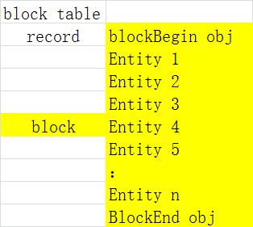

#### Block and extend-data

* block -- 就是储存在块表记录中实体对象的集合

  

* block define and block reference

  ```
   块定义就是 定义保存块的实际几何组成， 而块参照就是用插入点和比例因子去存储块定义的

   _块 -- 模具_ 

   _块参照 -- 模型_
  ```

在我们工程中对 可以添加 对不同形状的沙发图进行块定义，然后形成相应的对象作为记录插入到块表之后，再创建块参照,然后再

